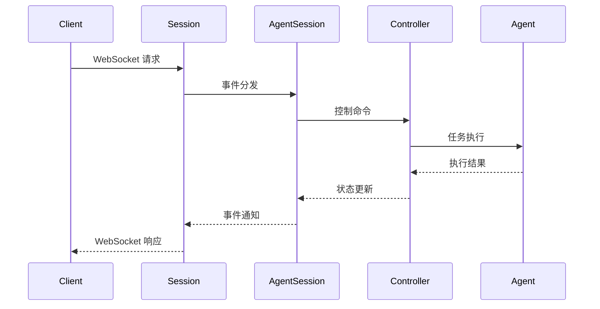
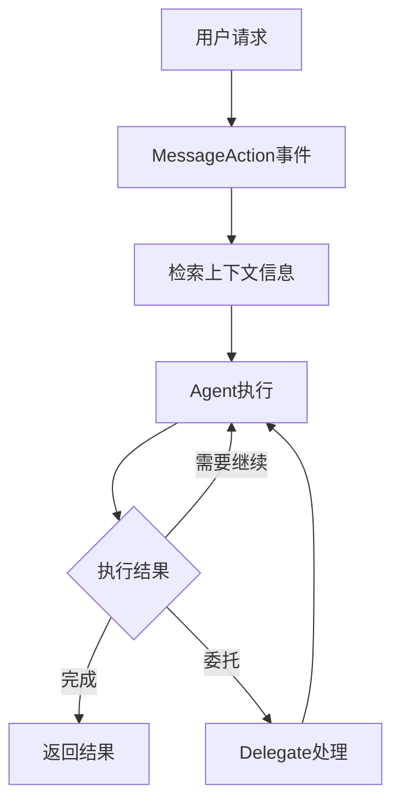
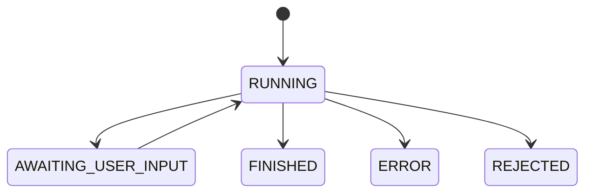
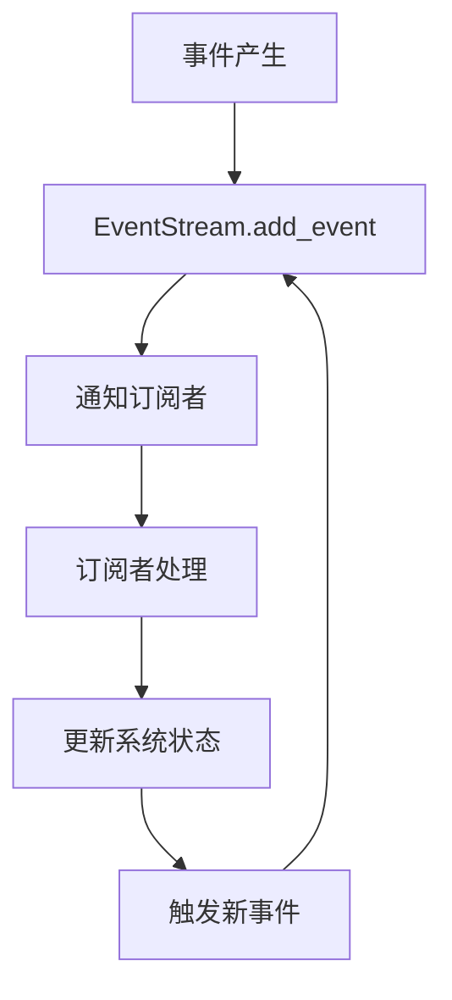
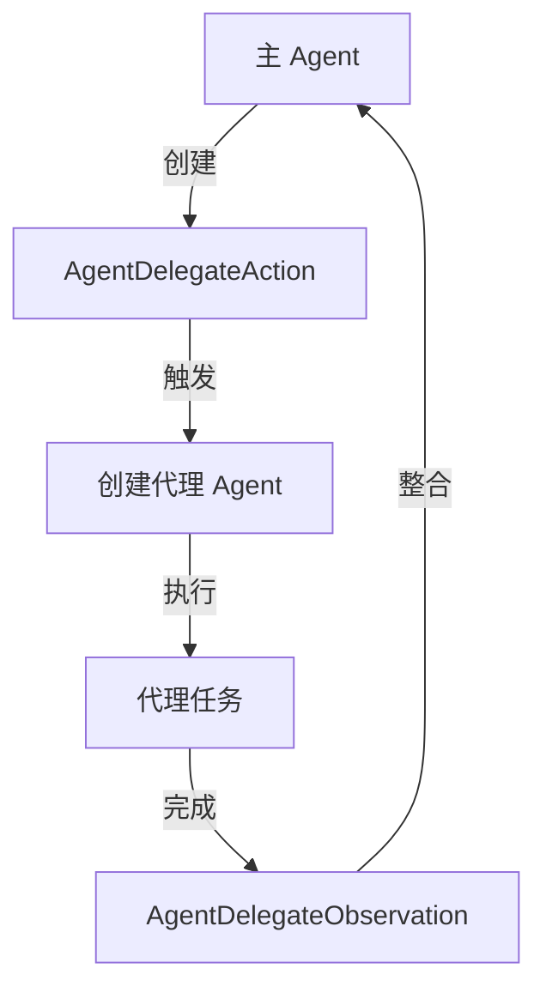

# OpenHands 架构设计

## 整体流程

OpenHands 采用基于 WebSocket 的实时通信架构，通过事件驱动的方式处理用户请求。以下是一个完整的请求处理流程：

### 1. 前端请求发起
- 用户在前端界面进行操作（输入指令、点击按钮等）
- 前端通过 WebSocket 连接向服务器发送请求
- 请求格式化为标准的 Action 格式：
  ```typescript
  {
    action: string;    // 动作类型
    args: object;      // 动作参数
    message: string;   // 可显示在聊天日志中的友好消息
  }
  ```

### 2. 服务器处理
- WebSocket 服务器（openhands/server/listen.py）接收请求
- 每个客户端连接创建独立的 `Session` 实例
- Session 管理器负责：
  - 处理 WebSocket 连接和断开
  - 初始化和管理 agent 会话
  - 在客户端和 agent 之间分发事件

### 3. Agent 处理
- 请求被转发给对应 session 的 Agent
- Agent 在其运行时环境中执行操作
- 支持的操作类型包括：
  - `read`: 读取文件内容
  - `write`: 写入文件内容
  - `run`: 执行命令
  - `browse`: 打开网页
  - `think`: 进行规划或记录想法
  - `finish`: 标记任务完成

### 4. 响应返回
- Agent 处理完成后生成 Observation（观察结果）
- Observation 包含：
  ```typescript
  {
    observation: string;  // 观察类型
    content: string;      // 观察到的数据
    extras: object;       // 额外的结构化数据
    message: string;      // 可显示在聊天日志中的友好消息
  }
  ```
- 服务器通过 WebSocket 将 Observation 发送回客户端

### 5. 前端展示
- 前端接收服务器响应
- 根据响应类型进行 UI 更新：
  - 显示执行结果
  - 更新文件内容
  - 展示错误信息
  - 更新聊天界面

### 6. 安全和会话管理
- 安全分析器进行实时监控
- `ConversationManager` 管理多个客户端会话
- 定期清理不活跃会话
- 对文件操作进行安全检查


### 核心组件层级

系统采用分层设计，主要包含以下核心组件：

#### 1. Session
会话层，负责处理 WebSocket 通信和基础会话管理：
- 维护 WebSocket 连接的生命周期
- 处理客户端事件的接收和分发
- 管理会话状态和活跃度
- 错误处理和状态消息发送
- 初始化和配置 AgentSession

#### 2. AgentSession
Agent 会话管理层，负责 Agent 的生命周期管理：
- 创建和初始化 Agent 实例
- 管理 Agent 的运行时环境
- 处理 Agent 的状态转换
- 维护 Agent 的配置信息
- 管理与 Git 提供者的集成

#### 3. Controller (AgentController)
控制层，负责具体的 Agent 控制逻辑：
- 执行流程的调度和控制
- 管理执行状态和限制
- 处理代理委托机制
- 监控执行指标
- 处理异常情况

#### 4. Agent
执行层，负责实际的任务执行：
- 接收和处理具体的任务
- 执行各类操作（文件读写、命令执行等）
- 生成执行结果和观察
- 维护任务执行状态
- 处理特定领域的逻辑

### 组件交互流程




## AgentController处理流程

OpenHands 采用事件驱动的方式处理用户请求，通过 AgentController 管理整个执行流程。


### 处理流程



### 主要步骤

1. **请求入口处理**
   - 接收用户消息，创建 MessageAction 事件
   - 检索相关上下文信息（RecallAction）
   - 设置 Agent 状态为 RUNNING

2. **执行控制**
   - 检查执行条件（状态、限制等）
   - 更新执行状态和指标
   - 调用 Agent 执行步骤
   - 处理返回的 Action

3. **执行限制**
   - 最大迭代次数控制
   - 预算限制控制
   - 循环检测
   - 状态监控

### 执行终止条件

- 达到最大迭代次数
- 超出预算限制
- 检测到执行循环
- Agent 完成任务（AgentFinishAction）
- Agent 拒绝任务（AgentRejectAction）
- 发生错误（ERROR 状态）
- 用户手动停止

### 代理委托机制

当 Agent 需要专门处理某些任务时，可以通过代理委托机制：

1. **委托触发**
   - Agent 返回 AgentDelegateAction
   - 创建新的专门 Agent
   - 设置代理状态和配置

2. **委托执行**
   - 代理接管事件处理
   - 独立执行任务
   - 维护自己的状态

3. **结果整合**
   - 代理完成后返回结果
   - 创建 AgentDelegateObservation
   - 主 Agent 继续执行

### 状态管理



### 安全机制

1. **资源控制**
   - 动态调整最大迭代次数
   - 预算使用监控
   - 执行时间限制

2. **异常处理**
   - 错误状态管理
   - 异常恢复机制
   - 用户通知

3. **循环检测**
   - 行为模式分析
   - 状态重复检查
   - 自动中断机制


## EventStream 事件流系统设计

EventStream 是 OpenHands 的核心组件之一，提供了事件驱动的基础架构支持。它负责管理和传递系统内所有组件间的事件通信。

### 核心概念

事件流系统主要包含以下核心概念:

- **事件(Event)**: 系统中传递的基本信息单元
- **订阅者(Subscriber)**: 接收和处理特定事件的组件
- **会话(Session)**: 通过 sid 标识的独立事件流上下文

### 事件类型

#### Action 类事件
- `MessageAction` - 消息交互动作
- `CmdRunAction` - 命令执行动作
- `AgentDelegateAction` - 代理委托动作
- `AgentFinishAction` - 代理完成动作
- `AgentRejectAction` - 代理拒绝动作

#### Observation 类事件
- `ErrorObservation` - 错误观察
- `AgentStateChangedObservation` - 代理状态变更
- `AgentDelegateObservation` - 代理委托观察
- `NullObservation` - 空观察

### 工作流程



### 实现细节

#### 核心组件

1. **EventStream**
   - 事件流的主要管理器
   - 维护订阅者列表
   - 处理事件分发

2. **EventQueue**
   - 基于优先级的事件队列
   - 确保事件按序处理
   - 支持异步处理

3. **EventBus**
   - 提供发布-订阅模式接口
   - 处理事件路由
   - 管理事件生命周期

#### 接口设计

```python
class IEventStream:
    async def add_event(self, event: Event) -> None
    async def subscribe(self, subscriber: EventSubscriber) -> None
    async def unsubscribe(self, subscriber: EventSubscriber) -> None
```

#### 异常处理

系统定义了以下异常类型：
- `EventStreamError` - 事件流基础异常
- `EventHandleError` - 事件处理异常
- `InvalidEventError` - 无效事件异常

### 使用示例

#### 创建订阅者

```python
class MySubscriber(EventSubscriber):
    async def on_event(self, event: Event) -> None:
        if isinstance(event, MessageAction):
            await self.handle_message(event)
```

#### 注册事件

```python
# 创建事件流实例
event_stream = EventStream()

# 注册订阅者
subscriber = MySubscriber()
await event_stream.subscribe(subscriber)

# 发送事件
event = MessageAction(content="Hello")
await event_stream.add_event(event)
```

### 扩展性

系统支持通过以下方式进行扩展：

1. 自定义事件类型
2. 插件化事件处理器
3. 中间件支持

## Delegate 代理机制

Delegate 是 OpenHands 系统中的一个重要机制，允许一个 Agent 将特定任务委托给另一个专门的 Agent 来处理。这种机制提供了任务分解和协作的能力。

### 核心概念

1. **代理动作 (AgentDelegateAction)**
   ```python
   class AgentDelegateAction(Action):
       agent: str  # 指定要使用的 Agent 类型
       inputs: dict  # 传递给代理的输入参数
   ```

2. **代理观察 (AgentDelegateObservation)**
   - 记录代理执行的结果
   - 包含代理的输出和状态信息

### 执行流程



### 主要特点

1. **独立执行环境**
   - 代理 Agent 拥有独立的执行环境
   - 维护自己的状态和上下文
   - 可以独立处理事件和任务

2. **状态管理**
   ```python
   state = State(
       session_id=self.id.removesuffix('-delegate'),
       inputs=action.inputs or {},
       iteration=self.state.iteration,
       delegate_level=self.state.delegate_level + 1,
       metrics=self.state.metrics,  # 共享指标
   )
   ```

3. **结果整合**
   ```python
   def end_delegate(self) -> None:
       delegate_outputs = self.delegate.state.outputs
       obs = AgentDelegateObservation(outputs=delegate_outputs, content=content)
       self.event_stream.add_event(obs, EventSource.AGENT)
   ```

### 与 Tool 的区别

1. **执行粒度**
   - Tool：执行单个具体操作（命令、代码等）
   - Delegate：执行一个完整的子任务

2. **执行环境**
   - Tool：在当前环境中执行
   - Delegate：创建新的执行环境

3. **状态管理**
   - Tool：共享当前状态
   - Delegate：维护独立状态

4. **结果处理**
   - Tool：直接返回结果
   - Delegate：需要等待和整合结果

5. **使用场景**
   - Tool：适合执行具体的、原子性的操作
   - Delegate：适合处理复杂的、需要专门能力的任务

6. **资源消耗**
   - Tool：资源消耗较小，执行快速
   - Delegate：资源消耗较大，执行时间较长

### 应用场景

1. **代码生成任务**
   - 主 Agent 分析需求
   - 委托给专门的编码 Agent 实现代码
   - 委托给测试 Agent 进行测试

2. **数据分析任务**
   - 主 Agent 确定分析目标
   - 委托给数据清洗 Agent 处理数据
   - 委托给分析 Agent 进行数据分析

3. **复杂问题解决**
   - 主 Agent 分解问题
   - 委托给专门的研究 Agent 深入研究
   - 整合多个代理的结果

### 优势

1. **模块化设计**
   - 每个 Agent 可以专注于特定类型的任务
   - 便于维护和扩展系统功能

2. **灵活的任务分配**
   - 可以根据任务特点选择合适的 Agent
   - 支持动态的任务分配

3. **资源优化**
   - 可以针对不同任务使用不同的模型配置
   - 优化资源使用效率

4. **错误隔离**
   - 代理的错误不会直接影响主 Agent
   - 便于错误处理和恢复

### 实现细节

1. **代理创建**
   ```python
   async def start_delegate(self, action: AgentDelegateAction):
       agent_cls: Type[Agent] = Agent.get_cls(action.agent)
       agent_config = self.agent_configs.get(action.agent, self.agent.config)
       llm_config = self.agent_to_llm_config.get(action.agent, self.agent.llm.config)
       delegate_agent = agent_cls(llm=llm, config=agent_config)
   ```

2. **事件处理**
   ```python
   def on_event(self, event: Event) -> None:
       if self.delegate is not None:
           delegate_state = self.delegate.get_agent_state()
           if delegate_state not in (AgentState.FINISHED, AgentState.ERROR, AgentState.REJECTED):
               self.delegate._on_event(event)
               return
   ```

3. **状态转换**
   ```mermaid
   stateDiagram-v2
       [*] --> RUNNING
       RUNNING --> DELEGATING
       DELEGATING --> RUNNING
       DELEGATING --> ERROR
       DELEGATING --> FINISHED
   ```
