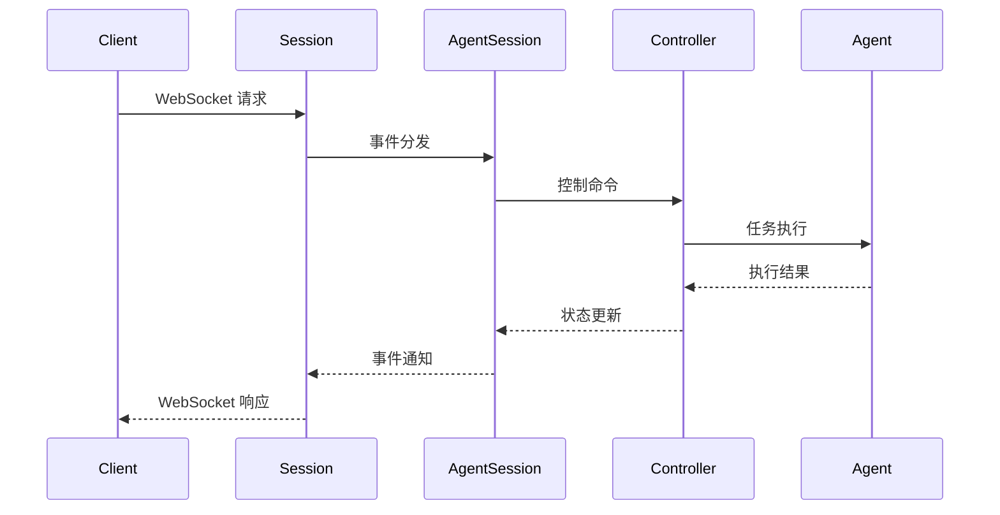
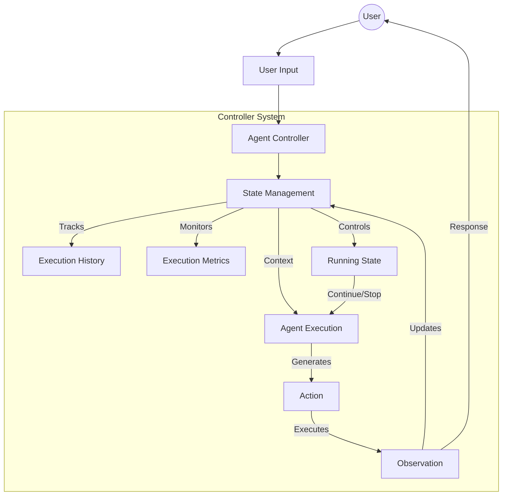

# OpenHands 架构设计

## 整体流程

OpenHands 采用基于 WebSocket 的实时通信架构，通过事件驱动的方式处理用户请求。以下是一个完整的请求处理流程：

### 1. 前端请求发起
- 用户在前端界面进行操作（输入指令、点击按钮等）
- 前端通过 WebSocket 连接向服务器发送请求
- 请求格式化为标准的 Action 格式：
  ```typescript
  {
    action: string;    // 动作类型
    args: object;      // 动作参数
    message: string;   // 可显示在聊天日志中的友好消息
  }
  ```

### 2. 服务器处理
- WebSocket 服务器（openhands/server/listen.py）接收请求
- 每个客户端连接创建独立的 `Session` 实例
- Session 管理器负责：
  - 处理 WebSocket 连接和断开
  - 初始化和管理 agent 会话
  - 在客户端和 agent 之间分发事件

### 3. Agent 处理
- 请求被转发给对应 session 的 Agent
- Agent 在其运行时环境中执行操作
- 支持的操作类型包括：
  - `read`: 读取文件内容
  - `write`: 写入文件内容
  - `run`: 执行命令
  - `browse`: 打开网页
  - `think`: 进行规划或记录想法
  - `finish`: 标记任务完成

### 4. 响应返回
- Agent 处理完成后生成 Observation（观察结果）
- Observation 包含：
  ```typescript
  {
    observation: string;  // 观察类型
    content: string;      // 观察到的数据
    extras: object;       // 额外的结构化数据
    message: string;      // 可显示在聊天日志中的友好消息
  }
  ```
- 服务器通过 WebSocket 将 Observation 发送回客户端

### 5. 前端展示
- 前端接收服务器响应
- 根据响应类型进行 UI 更新：
  - 显示执行结果
  - 更新文件内容
  - 展示错误信息
  - 更新聊天界面

### 核心组件层级

系统采用分层设计，主要包含以下核心组件：

#### 1. Session
会话层，负责处理 WebSocket 通信和基础会话管理：
- 维护 WebSocket 连接的生命周期
- 处理客户端事件的接收和分发
- 管理会话状态和活跃度
- 错误处理和状态消息发送
- 初始化和配置 AgentSession

#### 2. AgentSession
Agent 会话管理层，负责 Agent 的生命周期管理：
- 创建和初始化 Agent 实例
- 管理 Agent 的运行时环境
- 处理 Agent 的状态转换
- 维护 Agent 的配置信息
- 管理与 Git 提供者的集成

#### 3. Controller (AgentController)
控制层，负责具体的 Agent 控制逻辑：
- 执行流程的调度和控制
- 管理执行状态和限制
- 处理代理委托机制
- 监控执行指标
- 处理异常情况

#### 4. Agent
执行层，负责实际的任务执行：
- 接收和处理具体的任务
- 执行各类操作（文件读写、命令执行等）
- 生成执行结果和观察
- 维护任务执行状态
- 处理特定领域的逻辑

### 组件交互流程




## AgentController处理流程

OpenHands 采用事件驱动的方式处理用户请求，通过 AgentController 管理整个执行流程。


### 处理流程



### 主要步骤

1. **请求入口处理**
   - 接收用户消息，创建 MessageAction 事件
   - 检索相关上下文信息（RecallAction）
   - 设置 Agent 状态为 RUNNING

2. **执行控制**
   - 检查执行条件（状态、限制等）
   - 更新执行状态和指标
   - 调用 Agent 执行步骤
   - 处理返回的 Action

3. **执行限制**
   - 最大迭代次数控制
   - 预算限制控制
   - 循环检测
   - 状态监控

### 执行终止条件

- 达到最大迭代次数
- 超出预算限制
- 检测到执行循环
- Agent 完成任务（AgentFinishAction）
- Agent 拒绝任务（AgentRejectAction）
- 发生错误（ERROR 状态）
- 用户手动停止
