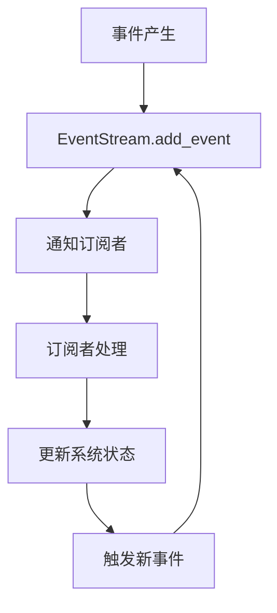

## EventStream 事件流系统设计

EventStream 是 OpenHands 的核心组件之一，提供了事件驱动的基础架构支持。它负责管理和传递系统内所有组件间的事件通信。

### 核心概念

事件流系统主要包含以下核心概念:

- **事件(Event)**: 系统中传递的基本信息单元
- **订阅者(Subscriber)**: 接收和处理特定事件的组件
- **会话(Session)**: 通过 sid 标识的独立事件流上下文

### 事件类型

#### Action 类事件
- `MessageAction` - 消息交互动作
- `CmdRunAction` - 命令执行动作
- `AgentDelegateAction` - 代理委托动作
- `AgentFinishAction` - 代理完成动作
- `AgentRejectAction` - 代理拒绝动作

#### Observation 类事件
- `ErrorObservation` - 错误观察
- `AgentStateChangedObservation` - 代理状态变更
- `AgentDelegateObservation` - 代理委托观察
- `NullObservation` - 空观察

### 工作流程

